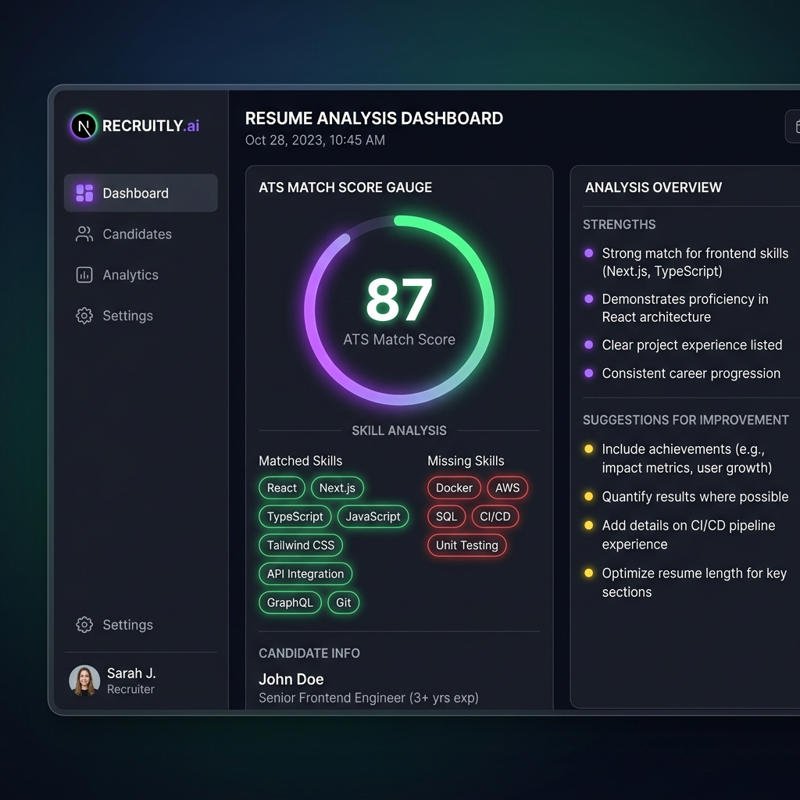
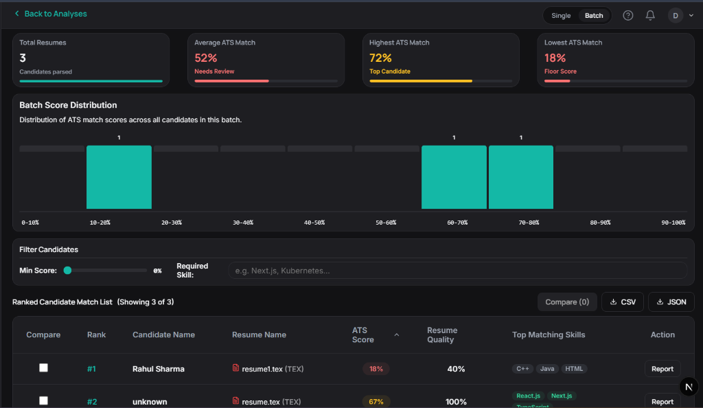
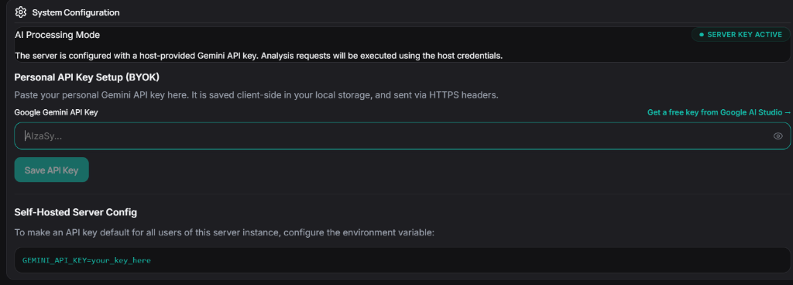

# bluntly 
> **AI Resume Analyser for CS Students — Checks Education, Skills, GitHub, and more.**

Bluntly is a premium, privacy-first open-source AI resume analyser and candidate matching dashboard. Built specifically to help computer science students optimize their resumes, Bluntly parses, scrubs, evaluates, and ranks resumes against real-world job descriptions using Google Gemini 1.5 Flash, a local heuristic compliance engine, and public GitHub portfolio integration.

<div align="center">

[](LICENSE)
[](https://nextjs.org)
[](https://react.dev)
[](https://ai.google.dev/)
[](CONTRIBUTING.md)

</div>

---

## 📋 Table of Contents
- [ Why Bluntly Exists](#-why-bluntly-exists)
- [ Key Features](#-key-features)
- [ Tech Stack](#-tech-stack)
- [ Screenshots in Action](#-screenshots-in-action)
- [ Quick Start](#-quick-start)
- [ Project Architecture](#-project-architecture)
- [ Contributing](#-contributing)
- [ License](#️-license)

---

##  Why Bluntly Exists
Standard Applicant Tracking Systems (ATS) are black boxes that reject qualified CS students without giving actionable feedback, often failing to account for critical non-academic indicators like open-source contributions. Bluntly solves this by giving students a clear, visual report showing how their education, technical skills, and public GitHub repositories align with job requirements. It operates on a **Bring Your Own Key (BYOK)** model, ensuring that candidate resume data and API keys remain completely private and under the candidate's control.

---

##  Key Features

- ** Privacy-First PII Redaction**: Built-in client-side scrubbing via [pii.js](src/lib/pii.js) runs locally in the browser/server environment. It automatically redacts emails, phone numbers, location addresses, social profiles (LinkedIn, GitHub, etc.), and candidate names before transmitting any data to AI endpoints.
- **Hybrid Assessment Engine**: Tailored evaluations combining:
  1. **Dynamic Rubric Generation**: Tailored candidate benchmarks generated on-the-fly based on the target job requirements.
  2. **Heuristic Rule Engine**: Code-based checks for resume quality (page-length optimization, font/formatting, buzzword density, and contact details integrity).
  3. **Hard Requirements Comparison**: Checks for education thresholds, specific technologies, and minimum years of experience.
- ** GitHub Portfolio Integration**: Integrates public candidate data fetched via [github.js](src/lib/github.js) (repositories, stars, activity, top languages) into the final fit score to highlight open-source contributions.
- ** Individual & Batch Matching Views**:
  - **Individual View**: View interactive gauge scores, section breakdown charts, color-coded skill chips, and tabbed checklists showing strengths and recommendations.
  - **Batch View**: Drag-and-drop up to 20 resumes concurrently. Progress streams live via Server-Sent Events (SSE). Compare candidates in a sortable ranking grid and export the analysis as CSV/JSON.
- ** Bring Your Own Key (BYOK)**: Works entirely using your own API keys. No database setup is required for local storage mode, and candidate privacy is protected.

---

##  Tech Stack
- **Core Framework**: [Next.js (v16.2.7)](https://nextjs.org/) utilizing the App Router architecture for unified client/server rendering.
- **UI & Layout**: [React (v19.2.4)](https://react.dev/) and Vanilla CSS for custom premium styles, featuring adaptation to dark/light modes and dynamic transition elements.
- **Large Language Model API**: [Google Gemini 1.5 Flash](https://ai.google.dev/) via `@google/generative-ai` for intelligent resume evaluations.
- **Semantic Search**: [@huggingface/transformers (v4.2.0)](https://github.com/huggingface/transformers.js) for local, client-side embedding analysis.
- **Database & Authentication (Optional)**: [Supabase](https://supabase.com/) for shared team configurations, user tracking, and credits.
- **PDF Extraction**: `pdf-parse` for parsing text out of PDF files.

---

## 📸 Screenshots in Action

### Welcome & Authentication Gateway

  
*Unified login interface supporting password authentication, GitHub OAuth integration, and quick local BYOK access.*

### Individual Analysis Workspace

*Deep-dive analysis panel showing overall compatibility scores, matching skills, and recommendations.*

### Batch Candidate Matcher

*Compare up to 20 candidate resumes in real time with live SSE status updates and exportable rankings.*

### Settings & BYOK API Configuration

*Configure your own Gemini API keys and GitHub tokens locally in the browser.*

---

##  Quick Start

### 1. Clone the Repository
```bash
git clone https://github.com/your-username/bluntly.git
cd bluntly
```

### 2. Install Dependencies
```bash
npm install
```

### 3. Configure Environment (Optional for Local Storage Mode)
Bluntly runs in **Local Dev Mode** automatically, storing all scans and API keys locally in your browser's `localStorage` (no server config required). 

If you want to configure a shared server environment with Supabase:
```bash
cp .env.example .env.local
```
Fill out the variables in `.env.local`:
```env
GEMINI_API_KEY=your_global_gemini_api_key
NEXT_PUBLIC_SUPABASE_URL=your_supabase_project_url
NEXT_PUBLIC_SUPABASE_ANON_KEY=your_supabase_anon_key
```

### 4. Run Development Server
```bash
npm run dev
```
Navigate to [http://localhost:3000](http://localhost:3000) to view Bluntly.

---

##  Project Architecture

A high-level view of key modules:
- [src/lib/parsers.js](src/lib/parsers.js) — PDF and LaTeX textual parsing engine.
- [src/lib/pii.js](src/lib/pii.js) — Client-side regular expression rules to scrub PII.
- [src/lib/gemini.js](src/lib/gemini.js) — AI comparison logic, scoring heuristics, and fallback mock engine.
- [src/lib/github.js](src/lib/github.js) — Portfolio activity and stats calculation service.
- [schema.sql](schema.sql) — SQL table setup and Row Level Security policies.

---

##  Contributing
Contributions make the open-source community amazing! Please read our [Contributing Guidelines](CONTRIBUTING.md) to get started on setting up your local environment and submitting Pull Requests.

---

##  License
Distributed under the MIT License. See [LICENSE](LICENSE) for more details.
